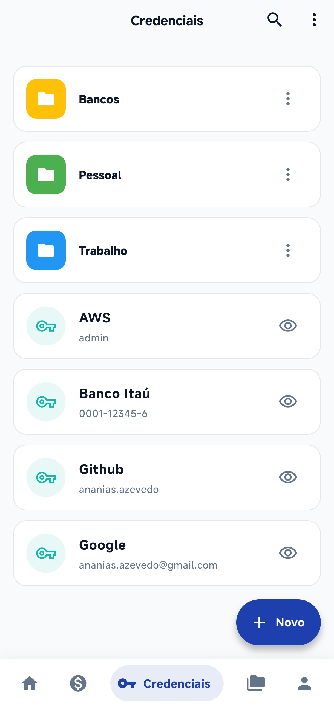
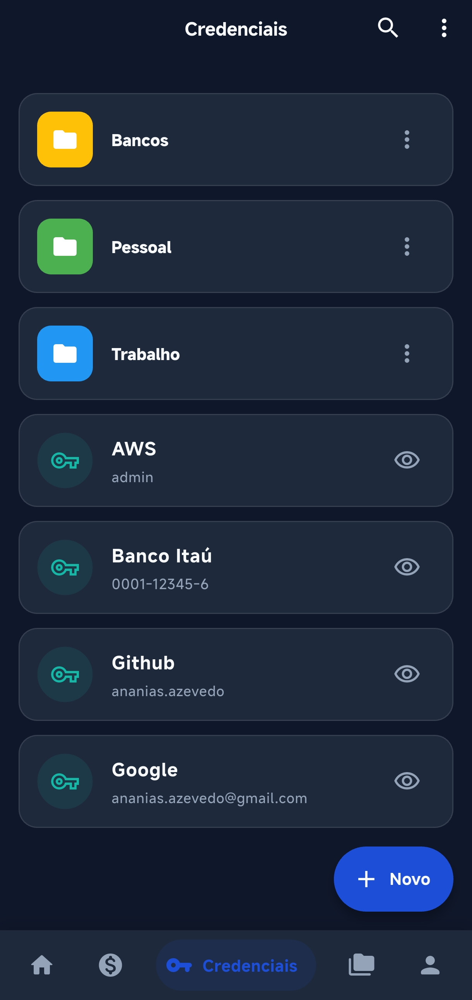
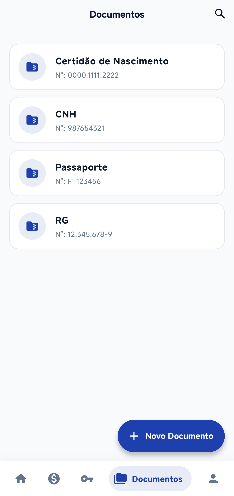
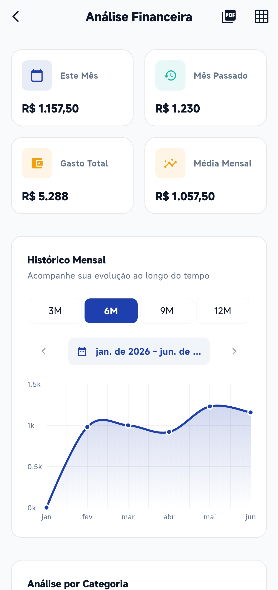
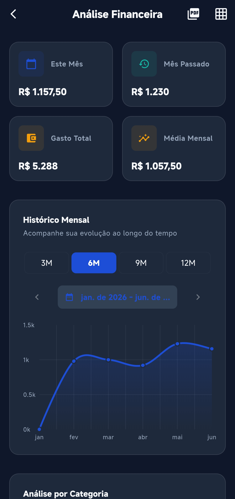
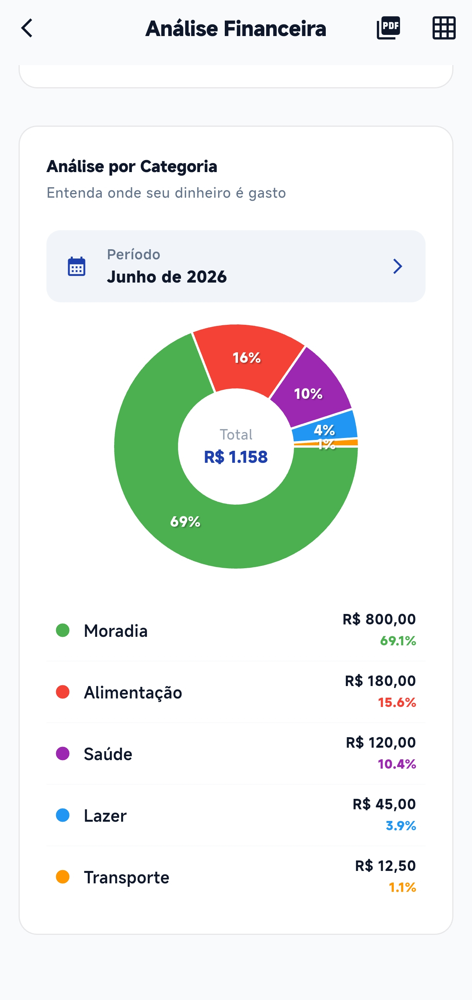
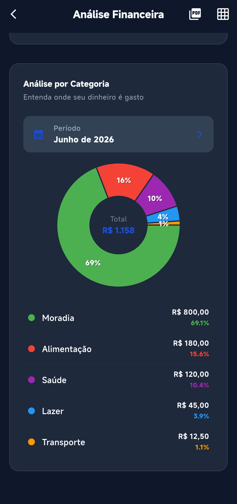
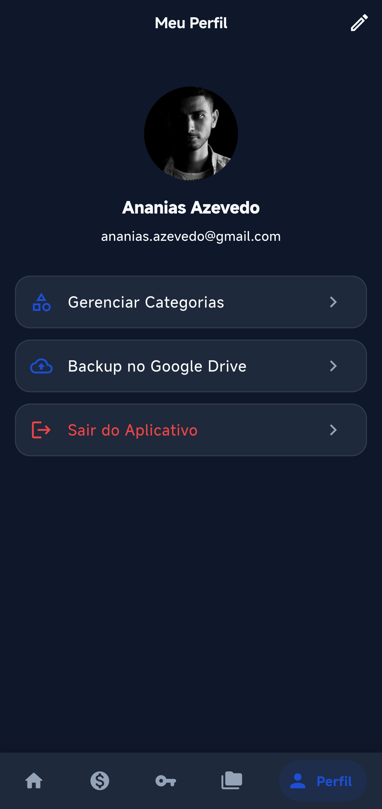

<div align="center">

# KeyBudget

[](https://flutter.dev/)
[](https://dart.dev/)
[](https://firebase.google.com/)
[](https://riverpod.dev/)

</div>

O **KeyBudget** é um aplicativo financeiro e gerenciador de credenciais construído em Flutter. Ele fornece um ambiente unificado e seguro para o controle detalhado de despesas, categorização de gastos, relatórios analíticos e armazenamento de dados sensíveis (senhas e documentos) utilizando criptografia AES executada diretamente no dispositivo (on-device) antes de qualquer sincronização com a nuvem.

## Funcionalidades Principais

* **Controle Financeiro**: Gestão completa de despesas mensais e recorrentes, criação de categorias personalizadas e visão geral do fluxo de caixa.
* **Cofre de Credenciais e Documentos**: Armazenamento seguro e criptografado de credenciais de login e documentos importantes, utilizando o algoritmo AES (pacote `encrypt`).
* **Análises Gráficas**: Interface visual rica com gráficos de tendência e distribuição por categoria, operada nativamente pelo pacote `fl_chart`.
* **Segurança e Biometria**: Integração com autenticação biométrica nativa (`local_auth`) e regras rígidas de expiração de sessão em segundo plano.
* **Autenticação Flexível**: Gerenciamento de usuários através do Firebase Auth com suporte a e-mail/senha e Google Sign-In.
* **Portabilidade de Dados e OCR**: Exportação nativa de relatórios (CSV/PDF) e leitura inteligente de recibos via `google_mlkit_text_recognition`.

## Telas do Aplicativo

<div align="center">
  <h4>Dashboard Inicial & Registro de Despesas</h4>
  
  
  
  
  
  <h4>Gerenciador de Credenciais & Documentos Armazenados</h4>
  
  
  
  

  <h4>Análise Gráfica Mensal & Distribuição</h4>
  
  
  
  

  <h4>Perfil e Configurações</h4>
  
  
</div>

## Estrutura do Código e Arquitetura

O projeto adota uma arquitetura modular baseada em *Feature-First*, combinada com a injeção de dependências do Riverpod. Isso garante um isolamento rigoroso entre as camadas de visualização (UI), regras de negócio (ViewModels) e acesso a dados (Repositories).

```text
lib/
├── app/                  # Configurações globais, widgets base da interface raiz
├── core/                 # Componentes compartilhados através de todo o aplicativo
│   ├── design_system/    # Tokens de UI: Cores, tipografia, espaçamentos e componentes base
│   ├── models/           # Classes de modelo (Entity)
│   ├── services/         # Serviços de infraestrutura (Criptografia, Biometria, OCR, PDF)
│   └── utils/            # Funções utilitárias e formatadores estáticos
├── features/             # Módulos de negócio independentes (Feature-First)
│   ├── analysis/         # Gráficos e inteligência de dados
│   ├── auth/             # Autenticação e registro
│   ├── category/         # Gestão de categorias de despesas
│   ├── credentials/      # Cofre de senhas criptografadas
│   ├── dashboard/        # Tela inicial (Overview)
│   ├── documents/        # Gerenciamento de documentos armazenados
│   ├── expenses/         # Fluxo de registro e acompanhamento de gastos
│   ├── suppliers/        # Relacionamento de fornecedores
│   └── user/             # Configurações de perfil
└── main.dart             # Ponto de entrada (Entrypoint)
```

## Pré-requisitos do Ambiente

Para compilar e executar o projeto nativamente, certifique-se de configurar o seu ambiente adequadamente:

* [Flutter SDK](https://docs.flutter.dev/get-started/install) nas versões `>=3.4.3 <4.0.0`.
* Acesso ativo ao console do Firebase com as configurações (`google-services.json` e `GoogleService-Info.plist`) prontas para Android e iOS.
* Criação de uma chave AES estática (32 bytes) para garantir a consistência dos testes e uso local.

## Guia de Instalação e Execução

1. **Clone o Repositório**

```bash
git clone https://github.com/viniciusmecosta/KeyBudget.git
cd KeyBudget
```

2. **Configuração Firebase e Nativa**

Acesse o Firebase, crie o projeto e adicione os descritores correspondentes em:
- `android/app/google-services.json`
- `ios/Runner/GoogleService-Info.plist`

No Firebase Console, não esqueça de ativar os métodos do **Authentication** (E-mail/Senha e Google) e inicializar seu banco de dados no **Firestore**.

3. **Injeção de Variáveis de Ambiente**

Dentro do diretório raiz ou em `assets/` (conforme especificado na configuração do `flutter_dotenv`), crie o arquivo `.env` contendo a chave para a camada de criptografia. 

```env
ENCRYPTION_KEY=SuaChaveDeSegurancaExata32Bytes!
```

4. **Instalação das Dependências**

```bash
flutter pub get
```

5. **Compilação e Execução**

Para executar o projeto em modo de desenvolvimento com hot-reload ativo:

```bash
flutter run
```

## Regras de Segurança do Firestore

A arquitetura de dados no Firestore foi modelada visando o isolamento rigoroso por usuário. Insira e publique estas diretrizes na aba *Rules* do seu painel do Firestore antes de lançar o app.

```javascript
rules_version = '2';

service cloud.firestore {
  match /databases/{database}/documents {
    // Isolamento de perfil por Usuário Autenticado
    match /users/{userId} {
      allow read, update: if request.auth != null && request.auth.uid == userId;
      allow create: if request.auth != null;
    }
    // Isolamento de Subcoleções (Despesas, Credenciais, etc)
    match /users/{userId}/{collection}/{docId} {
      allow read, write, create, delete: if request.auth != null && request.auth.uid == userId;
    }
  }
}
```